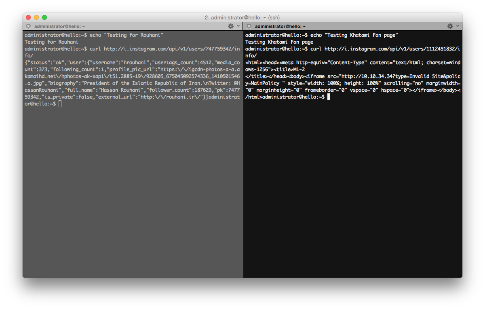
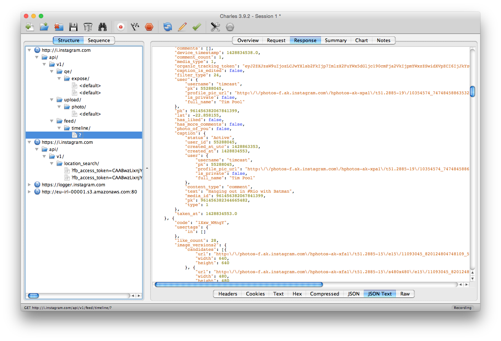
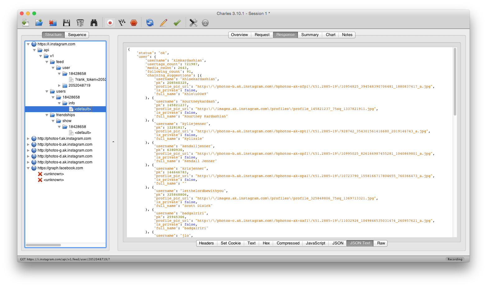

# Instaran

This repository contains the data and source code used for the research published on [Global Voices](https://advocacy.globalvoicesonline.org/2015/05/07/new-research-iran-is-using-intelligent-censorship-on-instagram/).

## Technical analysis of the block

Note: All of our measurements presented in this article have been done on [AS43343](https://ipinfo.io/AS43343) in mid-April, results might vary depending on time and location.

 

We found that content on Instagram is filtered by deep-packet inspection on the HTTP API endpoints. This filtering does not occur on the browser access of Instagram, since HTTPS is implemented. From our measurements, it appears that the filtering is done based on Instagram user identifiers, mainly targeting profile pages. Therefore, changing the username of a blocked account will not circumvent the blocking. More specifically, when an API endpoint is called such as `GET /api/v1/users/1112451832/info/`, the request is analyzed and if the user identifier corresponds to one that is on the blocklist, the M5-8 page will be returned. The M5-8 is the first block page Iranians encounter when trying to access filtered content.

Hereunder, a screenshot from a Instagram API call when we started our research (12th of April). The Instagram API was still uploading images over HTTP and all user activity besides “Instagram Direct” and login was over HTTP.

We have no evidence that any keyword or hashtag-based filtering is taking place to filter content on Instagram.
Finding blocked accounts
To facilitate the detection of blocked Instagram accounts, we developed a toolkit that provides multiple ways of exploring the Instagram social graph. We explored the graph by breadth-first search, marking each node representing a blocked account as a node to visit next.

The algorithm was seeded with a list of accounts of reportedly blocked accounts. We assumed that the density of blocked accounts amongst the followers and followings of a blocked account would be higher than average, facilitating discovery of new blocked accounts.

Due to limited server resources and Instagram API rate-limiting, we visited a total of 15 238 nodes in the area of this research. The subgraph visited is quite small and is dependent on the given seed.

### Facebook’s response

We shared our findings with Facebook Security Team, now in charge of Instagram.

> Thank you for sharing this information with us. The Instagram team is in the process of rolling out HTTPS for all Instagram users across the world.

Within days after our report, an Instagram update was released that loads user profiles and timelines over HTTPS. In addition to that, the upload of pictures is now happening over HTTPS too. Images are still loaded over HTTP and can be subject to eavesdropping.

We did the same few tests as we did before a few days (on the 1rst of May) after reporting our findings to Instagram. All API endpoints were moved to HTTPS. Pictures are still loaded over HTTP.

Most notable is that the Instagram API has been accessible over HTTPS for years. The Instagram developer documentation suggests third-party developers to use HTTPS since 2011. After a vulnerability to take over sessions was exposed in July 2014, Instagram adopted the HTTPS exclusively for the Instagram Direct endpoint, citing performance concerns were preventing full HTTPS adoption.

## Impact of HTTPS deployment on the filtering

With Instagram adopting HTTPS in the latest releases of their mobile apps, the 'intelligent' filtering capabilities of Iran are made obsolete. Currently, a few options are still open to them such as filtering on a per image basis (instead of a per user basis) since images are still served over HTTP from Instagram’s content delivery network. This would for instance prevent an offensive image to be displayed within a user’s profile page while the number of followers, biography, likes and comments of pictures would still be able to load since those are accessed over HTTPS. Instagram is reportedly working on serving that content over HTTPS too. After that deployment, Iran’s options will be limited. Being blinded about what content the user is browsing on the platform, it becomes an all or nothing choice with DPI filtering.

Iran appears to be determined to further their 'intelligent' filtering efforts, as previously mentioned. Since the Instagram app currently isn’t doing certificate pinning on Instagram API endpoints, man-in-the-middle attacks using an Iranian owned certificate is something that should be considered. Iranian users would have to install a certificate in their device’s trust store to access Instagram. Instagram can protect their users against that kind of eavesdropping and filtering by adopting certificate pinning.

## Licence

Source code license: Public Domain
